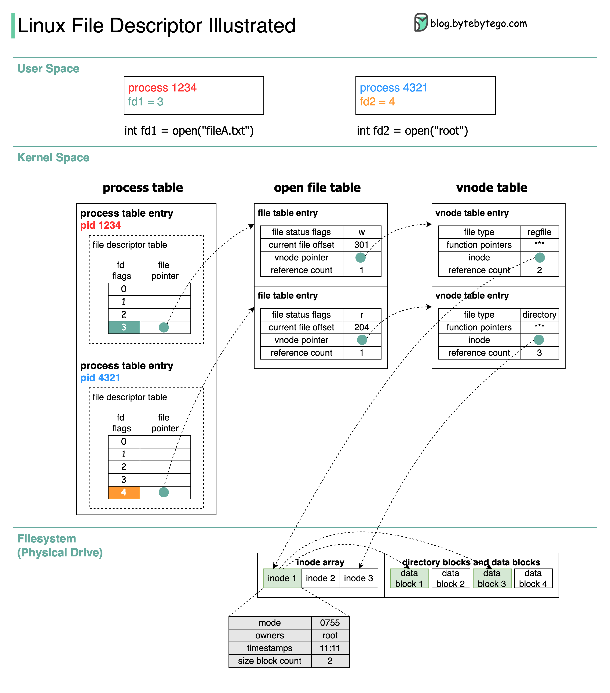

# Get_Next_Line

A C function that reads a file line by line, managing its own buffer.

## Project Overview

This project, part of the 42 school curriculum, delves into file reading and buffer management in C. It involves creating a `get_next_line` function that efficiently reads a line from a file descriptor, handling potential issues like newline characters spanning multiple reads.

## Key Concepts

### File Descriptors:

#### What is a File Descriptor?
How do we interact with Linux Filesystem via file descriptors?

A file descriptor represents an open file. It is a unique number assigned by the operating system to each file. It is an abstraction for working with files. We need to use file descriptors to read from or write to files in our program. Each process maintains its own file descriptor table. 

The diagram below shows the layered architecture in Linux filesystem. Let’s take process 1234 as an example.



🔹 In User Space
When we open a file called “fileA.txt” in Process 1234, we get file descriptor fd1, which is equal to 3. We can then pass the file descriptor to other functions to write data to the file.

🔹 In Kernel Space
In Linux kernel, there is a process table to maintain the data for the processes. Each process has an entry in the table. Each process maintains a file descriptor table, with file descriptors as its indices. Notice that file descriptors 0,1 and 2 are reserved in each file descriptor table to represent stdin, stdout, and stderr.

The file pointer points to an entry in the open file table, which has information about open files across all processes. Multiple file descriptors can point to the same file table entry. For example, file descriptor 0, 1 and 2 points to the same open file table entry. 

Since different open file table entries can represent the same file, it is a waste of resources to store the file static information so many times. We need another abstraction layer called ‘vnode table’ to store the static data.

In each file table entry, there is a vnode pointer, which points to an entry in vnode table. The static information includes file type, function pointers, reference counts, inode etc. inode describes a physical object in the filesystem.

🔹 In Filesystem
The inode array element stores the actual file information, including permission mode, owners, timestamps, etc. inode also points to the data blocks stored in the filesystem.

Over to you: When we close a file in a program, do you know which entries are deleted in these data structures?


- Unique integers that represent open files or other I/O resources.
- Used for reading, writing, and manipulating data within files.
- Explore more:
  - [File Descriptors in Unix-like Systems](https://man7.org/training/download/lusp_fileio_slides-mkerrisk-man7.org.pdf)
  - [File Descriptors and I/O](https://www.usna.edu/Users/cs/wcbrown/courses/IC221/classes/L09/Class.html)

### Processes and System Calls:

- Processes are independent programs running on an operating system.
- System calls are requests made by a process to the kernel for system services, such as file I/O.
- Read more: [Processes and System Calls](https://www.mat.unical.it/spataro/teaching/algoritmi/Linux-processes.pdf)

### Kernel:

- The core component of an operating system, responsible for managing hardware and software resources.
- Tasks include process management, memory management, device management, and I/O communication.

## Function Overview

### get_next_line:

- Takes a file descriptor and a pointer to a string as arguments.
- Reads a line from the file descriptor, storing it in the provided string.
- Returns 1 if a line was read successfully, 0 if the end of the file was reached, or -1 in case of an error.

## Implementation Details

### Buffer Management:

- The function utilizes a static buffer to store read data, optimizing memory usage.
- It efficiently handles cases where a newline character spans multiple reads.

### System Calls and Processes:

- The function internally uses the `read` system call to interact with the file.
- It operates within the context of the calling process, adhering to process memory and resource constraints.

## Usage

```
// Include the header get_next_line.h for mondatory part or get_next_line_bonus.h for bonus
#include "get_next_line.h"

char *line = NULL;
int fd = open("my_file.txt", O_RDONLY);
while ((line = get_next_line(fd))) {
    // Process the line here
    printf("%s\n", line);
    free(line);  // Free the allocated line
}
close(fd);  // Close the file descriptor

```

## Additional Information

Explore more about file descriptors: [Introduction to File Descriptors](https://bottomupcs.com/ch01s03.html)

## Contributions

Feel free to fork this repository and contribute to its improvement!
